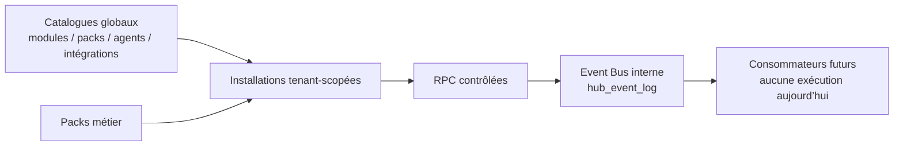

# Qualifyr Hub

Le Hub est le registre interne des extensions de Qualifyr. Il ne constitue ni une marketplace publique, ni un runtime de plugins. Les produits futurs restent séparés : une entrée de catalogue ne crée pas de CRM, de Website Builder, d’automatisation, de connecteur externe ou d’agent autonome.

Les catalogues décrivent identifiant, version, permissions, dépendances, compatibilité, manifestes et schémas de configuration. Les installations par organisation gardent seulement l’état et une configuration JSON non sensible.

## Sécurité et isolation

- Toutes les tables Hub ont RLS forcée.
- Les membres peuvent lire leur installation et l’historique de leur organisation ; aucune mutation directe n’est accordée.
- Les mutations passent par des fonctions `security definer` avec `search_path=''`, contrôle d’authentification et rôle `owner`/`admin`.
- Les fonctions publiques sont retirées de `PUBLIC` et `anon` puis accordées uniquement à `authenticated`.
- Les configurations refusent récursivement les clés assimilables à un secret (`token`, `secret`, `password`, `api_key`, etc.). Les connecteurs ne stockent donc aucun identifiant OAuth, clé API ou credential.
- Les dépendances doivent être actives avant l’activation d’un module ; un module avec dépendant actif ne peut pas être retiré.
- L’application d’un pack ne supprime rien : elle marque le pack précédent comme remplacé et installe seulement les manifestes requis.

## API interne

L’API interne est volontairement limitée aux RPC de gestion : `manage_hub_module`, `apply_hub_pack`, `manage_hub_agent`, `manage_hub_integration`. Chaque changement conserve un événement minimal dans `hub_event_log`. Les événements métier futurs sont seulement enregistrés dans `hub_event_definitions` : aucun abonné ni exécution asynchrone n’est implémenté.

## Limites intentionnelles

Les huit agents sont des manifestes sans fournisseur, outil exécutable ni modèle actif. Les intégrations sont des points d’extension sans endpoint, synchronisation ou secret. Les entrées marquées `planned` ne peuvent pas être activées.
